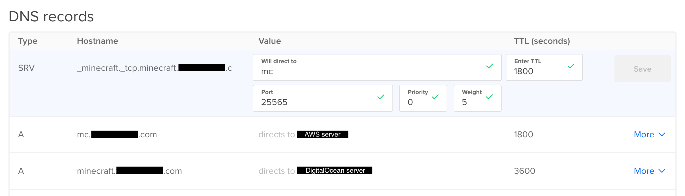
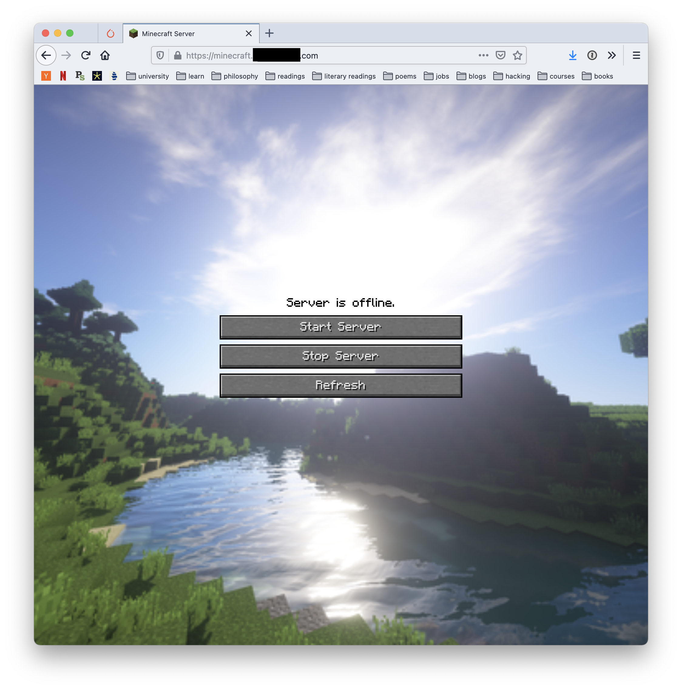

# Minecraft server

## Server

I run the minecraft server on a t2.medium instance from Amazon. _Later this will be a spot instance (m5.large) when I figure out how to automatically attach EBS storage to it._

The minecraft server is a [PaperMC server](https://papermc.io/), running on java 16. Install java 16 with `apt install openjdk-16-jre-headless`.

`/usr/games/minecraft/` contains:

```
├── minecraft_server -> minecraft_server-1.16.5-manhunt
├── minecraft_server-1.16.5
└── minecraft_server-1.16.5-manhunt
```

I used `ln -s minecraft_server-1.16.5-manhunt minecraft_server` to create a symbolic link (shortcut) to the minecraft server I want to play on.

To always start the server on boot I ran `systemctl enable minecraft.service`, you need the [configuration file](minecraft.service) at `/etc/systemd/system/minecraft.service`.

Playing on a new world now requires downloading or copying the server file and renaming it to `paper.jar`. Then running the appropriate ` ln -s target_path link_path` command and starting the service with `systemctl start minecraft.service` (provided the initial service is shut down), or restarting the server with `shutdown -r now`.


## Website

I have an instance on Digital Ocean serving a website, and the following DNS records


I tried using iptables to forward minecraft tcp traffic but couldn't get it to work, so I'm using an SRV record.

The website is powered by [Express](https://expressjs.com/) with [basic auth](https://www.npmjs.com/package/express-basic-auth) (over HTTPS), uses the [AWS SDK for JavaScript](https://aws.amazon.com/sdk-for-javascript/) to start/stop the instance, and in `/etc/nginx/sites-enabled/mc-site`

```
server {
    # this is not all there is...
    listen 443 ssl;
    server_name minecraft.example.com
    location / {
        proxy_pass http://localhost:8080;
        # ...
    }
}
```

The webserver is run using screen: `screen -S mc-site`, then `node .` and `ctrl+a d` to detach from the screen session.

The website looks like

